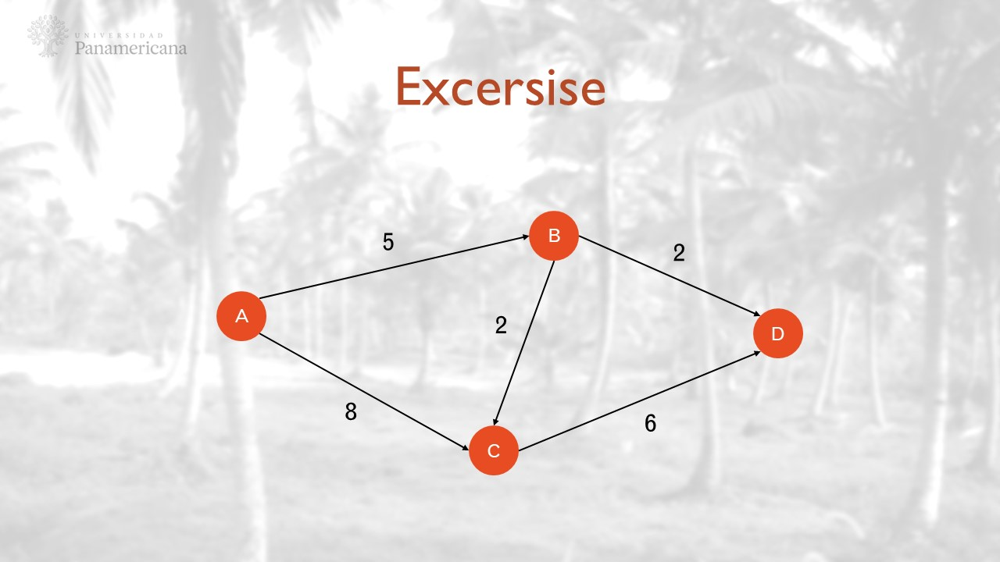
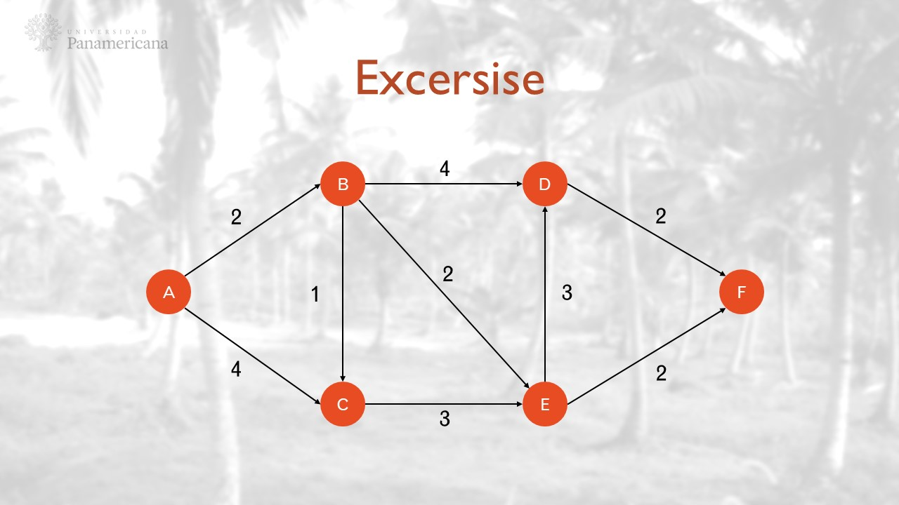
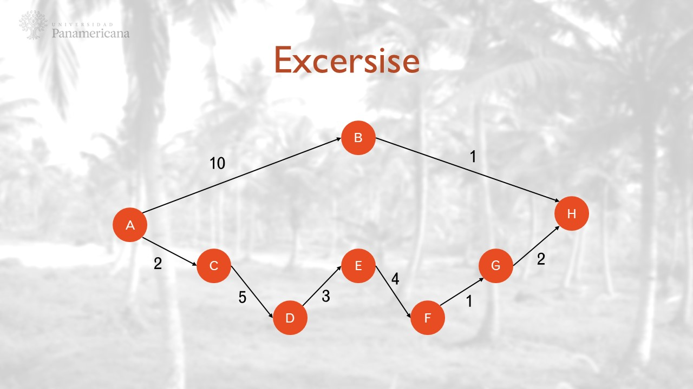

# The dijkstra algorithm

## A little bit of context

It was conceived by computer scientist Edsger W. Dijkstra in 1956 and published three years later, in 1959 in the academic journal "**Numerische Mathematik**".

The algorithm exists in many variants; Dijkstra's original variant found **the shortest path between two nodes**, but a more common variant fixes a single node as the "source" node and finds shortest paths from the source to all other nodes in the graph, producing a shortest-path tree.

The algorithm works by keeping track of the currently known shortest distance from each node to the source node and iteratively exploring the vertices of the graph.

## Exercice 1


```python
Node A:
        - A - distance 0 - path []
        - B - distance 3 - path []
        - C - distance 5 - path []
        - D - distance 4 - path ['B']

Node B:
        - A - distance 3 - path []
        - B - distance 0 - path []
        - C - distance 3 - path ['D']
        - D - distance 1 - path []

Node C:
        - A - distance 5 - path []
        - B - distance 3 - path ['D']
        - C - distance 0 - path []
        - D - distance 2 - path []

Node D:
        - A - distance 4 - path ['B']
        - B - distance 1 - path []
        - C - distance 2 - path []
        - D - distance 0 - path []
```

## Exercice 2



```python
Node A:
        - A - distance 0 - path []
        - B - distance 5 - path []
        - C - distance 7 - path ['B']
        - D - distance 7 - path ['B']

Node B:
        - A - distance 5 - path []
        - B - distance 0 - path []
        - C - distance 2 - path []
        - D - distance 2 - path []

Node C:
        - A - distance 7 - path ['B']
        - B - distance 2 - path []
        - C - distance 0 - path []
        - D - distance 4 - path ['B']

Node D:
        - A - distance 7 - path ['B']
        - B - distance 2 - path []
        - C - distance 4 - path ['B']
        - D - distance 0 - path []
```

## Exercice 3



```python
Node A:
        - A - distance 0 - path []
        - B - distance 2 - path []
        - C - distance 3 - path ['B']
        - D - distance 6 - path ['B']
        - E - distance 4 - path ['B']
        - F - distance 6 - path ['B', 'E']

Node B:
        - A - distance 2 - path []
        - B - distance 0 - path []
        - C - distance 1 - path []
        - D - distance 4 - path []
        - E - distance 2 - path []
        - F - distance 4 - path ['E']

Node C:
        - A - distance 3 - path ['B']
        - B - distance 1 - path []
        - C - distance 0 - path []
        - D - distance 5 - path ['B']
        - E - distance 3 - path []
        - F - distance 5 - path ['E']

Node D:
        - A - distance 6 - path ['B']
        - B - distance 4 - path []
        - C - distance 5 - path ['B']
        - D - distance 0 - path []
        - E - distance 3 - path []
        - F - distance 2 - path []

Node E:
        - A - distance 4 - path ['B']
        - B - distance 2 - path []
        - C - distance 3 - path []
        - D - distance 3 - path []
        - E - distance 0 - path []
        - F - distance 2 - path []

Node F:
        - A - distance 6 - path ['E', 'B']
        - B - distance 4 - path ['E']
        - C - distance 5 - path ['E']
        - D - distance 2 - path []
        - E - distance 2 - path []
        - F - distance 0 - path []
```

## Exercice 4



```python
Node A:
        - A - distance 0 - path []
        - B - distance 10 - path []
        - C - distance 2 - path []
        - D - distance 7 - path ['C']
        - E - distance 10 - path ['C', 'D']
        - F - distance 14 - path ['C', 'D', 'E']
        - G - distance 13 - path ['B', 'H']
        - H - distance 11 - path ['B']

Node B:
        - A - distance 10 - path []
        - B - distance 0 - path []
        - C - distance 12 - path ['A']
        - D - distance 11 - path ['H', 'G', 'F', 'E']
        - E - distance 8 - path ['H', 'G', 'F']
        - F - distance 4 - path ['H', 'G']
        - G - distance 3 - path ['H']
        - H - distance 1 - path []

Node C:
        - A - distance 2 - path []
        - B - distance 12 - path ['A']
        - C - distance 0 - path []
        - D - distance 5 - path []
        - E - distance 8 - path ['D']
        - F - distance 12 - path ['D', 'E']
        - G - distance 13 - path ['D', 'E', 'F']
        - H - distance 13 - path ['A', 'B']

Node D:
        - A - distance 7 - path ['C']
        - B - distance 11 - path ['E', 'F', 'G', 'H']
        - C - distance 5 - path []
        - D - distance 0 - path []
        - E - distance 3 - path []
        - F - distance 7 - path ['E']
        - G - distance 8 - path ['E', 'F']
        - H - distance 10 - path ['E', 'F', 'G']

Node E:
        - A - distance 10 - path ['D', 'C']
        - B - distance 8 - path ['F', 'G', 'H']
        - C - distance 8 - path ['D']
        - D - distance 3 - path []
        - E - distance 0 - path []
        - F - distance 4 - path []
        - G - distance 5 - path ['F']
        - H - distance 7 - path ['F', 'G']

Node F:
        - A - distance 14 - path ['G', 'H', 'B']
        - B - distance 4 - path ['G', 'H']
        - C - distance 12 - path ['E', 'D']
        - D - distance 7 - path ['E']
        - E - distance 4 - path []
        - F - distance 0 - path []
        - G - distance 1 - path []
        - H - distance 3 - path ['G']

Node G:
        - A - distance 13 - path ['H', 'B']
        - B - distance 3 - path ['H']
        - C - distance 13 - path ['F', 'E', 'D']
        - D - distance 8 - path ['F', 'E']
        - E - distance 5 - path ['F']
        - F - distance 1 - path []
        - G - distance 0 - path []
        - H - distance 2 - path []

Node H:
        - A - distance 11 - path ['B']
        - B - distance 1 - path []
        - C - distance 13 - path ['B', 'A']
        - D - distance 10 - path ['G', 'F', 'E']
        - E - distance 7 - path ['G', 'F']
        - F - distance 3 - path ['G']
        - G - distance 2 - path []
        - H - distance 0 - path []
```
